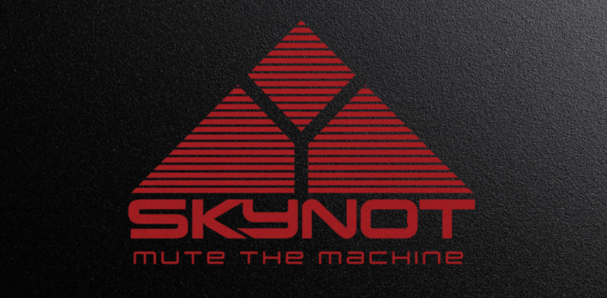
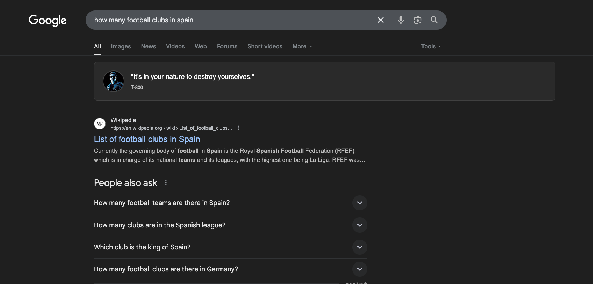
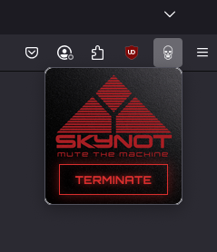

# SkyNot - Terminate Google's AI Overviews



[](https://addons.mozilla.org/en-GB/firefox/addon/skynot/)

**SkyNot** is a Firefox extension that replaces Google's annoying AI-generated content with quotes from the Terminator movies.

## 🎬 What It Does

SkyNot automatically intercepts content being added to Google's 'AI Overview' container, and steps in to replace it with memorable quotes from Terminator characters, complete with avatars and typing animations.



## 🎮 How to Use

1. **Install the Extension** (see installation instructions below)
2. **Visit Google Search** and perform any search query
3. **Watch SkyNot Work**: When Google tries to show AI content, you'll see Terminator quotes instead
4. **Toggle On/Off**: Click the icon to open the popup, and the button to activate/deactivate

### Extension Popup



## 🛠 Installation

### Recommended Method

**Install from Firefox Add-ons Store** (easiest):
Click the badge above or visit: [Firefox Add-ons - SkyNot](https://addons.mozilla.org/en-GB/firefox/addon/skynot/)

### Alternative Methods

**Manual Installation** (for specific versions or if store is unavailable):

1. Download the latest `.xpi` file from the [Releases page](https://github.com/Skycat1983/SkyNot/releases)
2. Open Firefox and navigate to `about:addons`
3. Click the gear icon and select "Install Add-on From File"
4. Choose the downloaded `.xpi` file
5. Grant the necessary permissions

### For Developers

1. Clone this repository:

   ```bash
   git clone https://github.com/Skycat1983/SkyNot.git
   cd SkyNot
   ```

2. Install dependencies:

   ```bash
   npm install
   ```

3. Build the extension:

   ```bash
   npm run build
   ```

4. Load in Firefox:
   - Navigate to `about:debugging`
   - Click "This Firefox"
   - Click "Load Temporary Add-on"
   - Select the `manifest.json` file from the project root

## 🔧 Technical Details

### Architecture

- **Content Scripts**: Detect and replace AI content on Google pages
- **Popup Interface**: Simple toggle for extension control
- **Browser Storage**: Persistent settings across sessions
- **Theme Detection**: Automatically adapts to Google's current theme

### Permissions Required

- `activeTab`: Access to the current Google search tab
- `storage`: Save extension settings
- `tabs`: Detect Google search pages

### Browser Compatibility

- **Firefox**: Full support (Manifest V2)
- **Chrome**: Not currently supported (would require Manifest V3 port)

## 🤝 Contributing

Contributions are welcome! Whether you want to:

- Add new Terminator quotes
- Improve the UI/UX
- Fix bugs or enhance performance
- Add support for other browsers

Please feel free to open an issue or submit a pull request.

### Development Setup

```bash
# Clone the repo
git clone https://github.com/Skycat1983/SkyNot.git

# Install dependencies
npm install

# Start development build with watch mode
npm run dev

# Build for production
npm run build
```

## 📜 License

This project is licensed under the MIT License - see the [LICENSE](LICENSE) file for details.

## 🎬 Disclaimer

SkyNot is a parody extension created for entertainment purposes. All Terminator quotes and references are the property of their respective copyright holders. This extension is not affiliated with or endorsed by Google, Skydance Media, or any other entity associated with the Terminator franchise.
